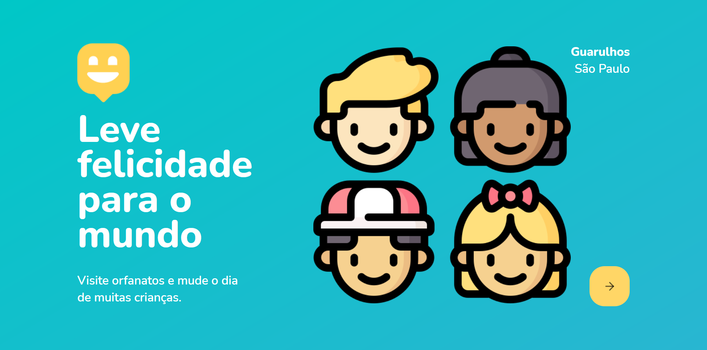

# 🧒 happy

## ℹ️ Sobre o proejto
- Aplicação mobile desenvolvida com React Navigate durante a NLW 3
- Projeto em React com base nos estudos da Rocketseat.
- Contém uma aplicção com back-end(node.js) e front-end(React).
- Este projeto consiste em uma aplicação mobile que reúne os orfanatos ao redor do Brasil.

## 🎯 Objetivo
- O objetivo do projeto é reunir os orfanatos e ajudar os mesmos com doações.
- 
 ## ✨ Demonstração

